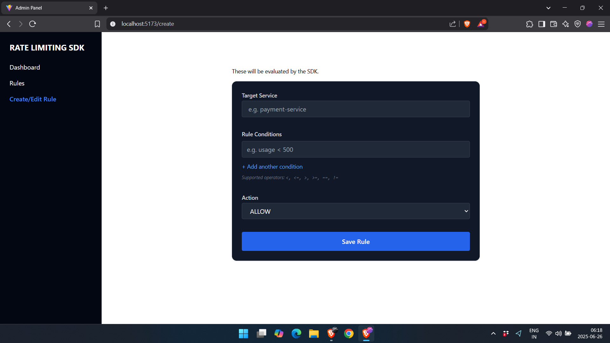
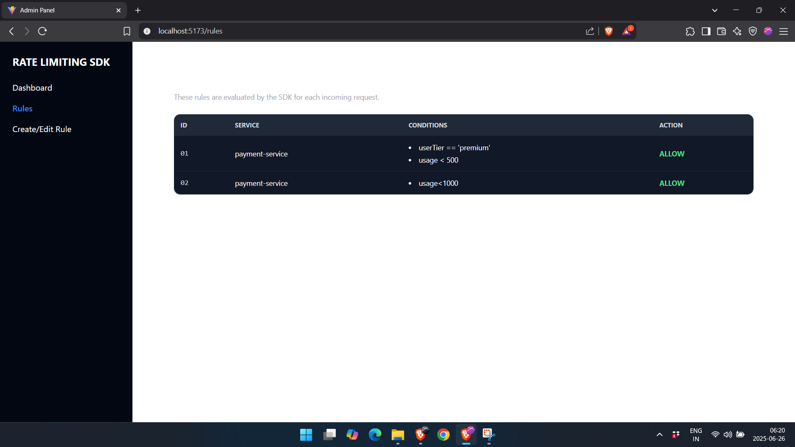
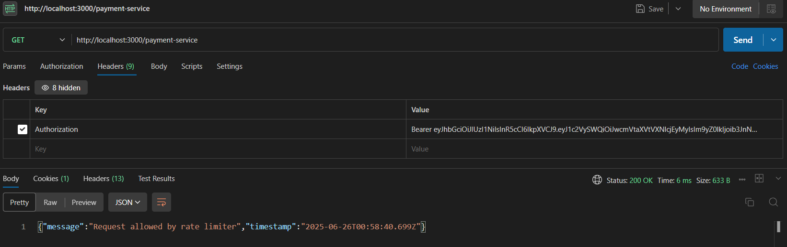

# Smart Rate Limiting SDK + Admin Panel (Proof of Concept)

**Note**: This POC uses Express.js for rapid development under time constraints. If selected for further work, I plan to refactor the backend using **TypeScript** and the **Godspeed framework** to ensure scalability, type safety, and production-grade maintainability.

A modular, dynamic rate-limiting system that combines:

* Context-aware SDK middleware
* Express.js backend with APIs for rules and context
* React + Tailwind Admin Panel for rule management and visibility

---

##  Objective

To demonstrate a robust mechanism for request-level access control using:

* **TTL-based caching** of service-specific rules
* **Real-time context** from incoming requests (usage, tier, org ID)
* **Declarative rule evaluation**, e.g.:
  `if usage < 500 && userTier == 'premium' then allow`

---

##  Architecture Overview

```
Client Request
       ↓
 [ SDK Middleware ]
     ↙      ↘
[ Rules Cache ] ← (Fetch from backend if missing or stale)
       ↓
[ Context API ] ← (Always fetch fresh)
       ↓
   [ Rule Engine ]
       ↓
 Allow or Block (HTTP 429) → Forward to Target Service
```
##  Smart Rate Limiter POC — Brief Summary

### Request Flow

- Client sends a request to `/payment-service` with a JWT in the `Authorization` header.

### SDK Middleware

- Extracts context (e.g. `userTier`, `usage`) from the JWT.
- Fetches rules from `mockRules.json` or a backend API.
- Matches the request's `service` and checks if all conditions pass.
- If conditions match and `action === "ALLOW"`, it calls `next()` → request proceeds.
- Otherwise, it responds with `429 Rate limit exceeded`.

### Route Handler

- Handles the request (e.g. `/payment-service`) only **if** middleware allows it.
- Sends a success response like:
  ```json
  {
    "message": "Request allowed by rate limiter",
    "timestamp": "2025-06-26T12:34:56.000Z"
  }

### What This POC Demonstrates

- **Rule-based access control** using centralized SDK middleware
- **Dynamic evaluation** of requests based on live user/service context
- **Admin-driven rule configuration** — no code changes or redeploys needed

---

##  Project Structure

```
## Project Structure

/smart-rate-limiter
├── backend/ # Express backend: /rules & /context endpoints
├── sdk/ # Reusable middleware SDK for request evaluation
├── admin/ # React + Tailwind admin interface
├── demo-app/ # Sample Express app using the SDK middleware
│ └── demo.js # JWT generator + curl command helper

```

---

##  Local Setup Instructions

### 1. Backend

```bash
cd backend
npm install
npm run dev
```

**API Endpoints:**

* `POST /rules` — Add a rule
* `GET /rules` — List all rules
* `POST /context` — Simulate context input (usage, tier)

---

### 2. SDK Middleware Demo

```bash
cd sdk
npm install
```

**Sample Responses:**

```json
{ "message": "Request allowed by rate limiter" }
```

```json
{ "error": "Rate limit exceeded", "rule": "usage > 500" }
```

---

### 3. Admin Panel

```bash
cd admin
npm install
npm run dev
```
#### 4. Demo App (Simulated Client)

```bash
cd demo-app
npm install
node demo.js

This will:

Generate a valid JWT token

Print a curl command with the token for easy testing:

bash
curl -H "Authorization: Bearer <token>" http://localhost:3000/payment-service
```


**Key Features:**

* View and manage rate limiting rules
* Create new conditional rules
* Visualize simulated activity
* Clean UI for edit/delete operations

---

##  Features Implemented

*  SDK middleware with JWT parsing
*  Rule and context APIs (Express)
*  Lightweight rule evaluation engine
*  Rule caching with TTL refresh
*  Admin Panel built with React + Tailwind
*  Simulated context-based rule enforcement
---

## Demo Screenshots

### Admin Panel – Create Rules



---

### Admin Panel – View Rules



---

### Postman Test – Rate Limit Result




This POC validates that dynamic access control via smart rule engines and context evaluation is feasible, scalable, and developer-friendly.
